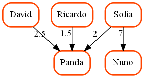

# Group Bank

### A Warning
**Take all of our security claims with a big grain of salt. We're not experienced cryptographers, we're students and this was made for a cryptography course. If you want to be sure that your data is safe, please don't use this as it's not even remotely tried and tested and we are not experienced in security.**

With that out of the way...

### What is Group Bank solving
Ever been caught in a debt triangle? You know: Mike owes you 20€ for dinner last night, but he’s waiting for Anna to pay him for back for pizza last weekend, and she is waiting for you to pay her back for those movie tickets… Sounds familiar?

In the end, it is possible that nobody owes anyone anything or that everything can be settled with just one transaction. Figuring this out is a pain the neck - it takes effort and time, and worst of all: involves math (shivers). Shiver no more, because this is a thing of the past. With GroupBank you will never have to think about this problem anymore.

Essentially, turning the mess on the left (and it is a very small example) into a manageable thing, on the right:
  

### Ok, how? I don't trust you with my transaction data

### Check out our wiki for more:
- What we are trying to do
- How our protocol works and why made certain decisions
- What we used to implement it and why
- How to set up the servers and what security concerns you should have if you manage them
- Our Internal API, i.e. the formal description of how the client interacts with the servers
- Planned improvements and ideas
